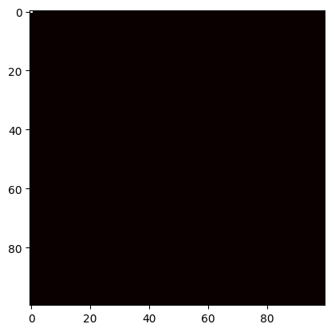

# cuda-point-source-pollution
CIS 677 GPU-Accelerated Modeling of Point-Source Pollution\
Dante and Jonah did cool stuff with CUDA.\
Here is a gif of our simulation, which was pretty cool\

Our report is included as a PDF too. If you wanna read it, feel free. 
 
